# Introduction
For Roulette game, there are many kinds of strategies. In this blog post, I want to talk about "Martingale" strategy. I am going to explain the answers about 4 questions below to explain the operating characteristics of "Martingale" strategy.

1) How did I use computer simulation to calculate the average earnings of a gambler that uses this strategy?
2) How does or does not changing a parameter of the simulation have an impact on average earnings?
3) How did I use computer simulation to estimate the average number of plays before stopping.
4) What is the limitation of the simulation?

# Background
"Martingale" strategy is that a gambler double the bet after every loss. In this way, he/she can recover all previous losses with win a profit which is equal to the original stake. 

In this simulation we have 4 parameters-B,W,L and M. B is the gambler's starting budget. W refers to winnings threshold for stopping, which means once your total budget hits this amount of money, you will stop the game. L means time threshold for stopping. You cannot play the game more than this number. Lastly, M is casino's maximum wager. It means that the casino does not allow you to wager more than this much money. Every parameter has starting value and you can see these in the box below.

Summary of parameters
---------------------

| Parameter | Description                     |             Starting value             |
|:---------:|:--------------------------------|:--------------------------------------:|
|   **B**   | Starting budget                 |                  $200                  |
|   **W**   | Winnings threshold for stopping | $300 (Starting budget + $100 winnings) |
|   **L**   | Time threshold for stopping     |               1000 plays               |
|   **M**   | Casino’s maximum wager          |                  $100                  |


# Methods
Here is the computer simulation I will use. 

I defined how a game works using "one_play" function. 

How much I will wager depends on the previous game's result, my current budget and the casino wager limit. If I win the previous game, my next prospective wager is $1. Otherwise, I will wager the double amount of my loss in the previous game. However, the wager can't exceed either my budget or the casino wager limit. Therefore, the least money among three will be my final next wager. Since there is 18 red color among 38 pockets, the probability that a red pocket will be selected is 18/38. If a red pocket is selected, then we earn money as much as I wagered before! However, if either green or black pocket is selected, I would lose the money I wagered before. I saved each play's budget in the budget vector. 

We can't play the roulette game forever. This is the reason why we need "stop_play" function. There are three case which will stop the game. The first case is when my budget become 0, which means I can't wager anymore! The second case is the number of played game become equal to the maximum number of plays. The last case is my budget is increased as same as the amount I planned to stop.

Finally, I am going to simulate this situation 10,000 times. Every time the game is over, my final budget is saved in the "walk_out_money" vector. For example, my first game's final budget is saved in "walk_out_money[1], and my second final budget will be saved in "walk_out_money[2]". Finally 10,000 final budget will be created.

Also, I calculated the number of plays in each simulation. The size of the budget vector is same with the number of played games in each simulation. 


```r
#' A single play of the Martingale strategy
#' number of plays  number, the number of plays in roulette
#' Takes a state list, spins the roulette wheel, returns the state list with updated values (for example, budget, plays, etc)
#' @param state A list with the following entries: 
#'   B              number, the budget
#'   W              number, the budget threshold for successfully stopping
#'   L              number, the maximum number of plays 
#'   M              number, the casino wager limit
#'   plays          integer, the number of plays executed
#'   previous_wager number, the wager in the previous play (0 at first play)
#'   previous_win   TRUE/FALSE, indicator if the previous play was a win (TRUE at first play)

#' @return The updated state list
one_play <- function(state){
  
    # Wager
    proposed_wager <- ifelse(state$previous_win, 1, 2*state$previous_wager)
    wager <- min(proposed_wager, state$M, state$B)

    # Spin of the wheel
    red <- rbinom(1,1,18/38)
 
    # Update state
    state$plays <- state$plays + 1
    state$previous_wager <- wager
    if(red){
      # WIN
      state$B <- state$B + wager
      state$previous_win <- TRUE
    }else{
      # LOSE
      state$B <- state$B - wager
      state$previous_win <- FALSE
    }
  state
}

#' Stopping rule
#'
#' Takes the state list and determines if the gambler has to stop
#' @param state A list.  See one_play
#' @return TRUE/FALSE
stop_play <- function(state){
  if(state$B <= 0) return(TRUE)
  if(state$plays >= state$L) return(TRUE)
  if(state$B >= state$W) return(TRUE)
  FALSE
}

#' Play roulette to either bankruptcy, success, or play limits
#'
#' @param B number, the starting budget
#' @param W number, the budget threshold for successfully stoping
#' @param L number, the maximum number of plays 
#' @param M number, the casino wager limit
#' @return A vector of budget values calculated after each play.
one_series <- function(
    B = 200
  , W = 300
  , L = 1000
  , M = 100
){

  # initial state
  state <- list(
    B = B
  , W = W
  , L = L
  , M = M
  , plays = 0
  , previous_wager = 0
  , previous_win = TRUE
  )

  # vector to store budget over series of plays
  budget <- rep(NA, L)
  
  # For loop of plays
  for(i in 1:L){
    new_state <- state %>% one_play
    budget[i] <- new_state$B
    if(new_state %>% stop_play){
      return(budget[1:i])
    }
    state <- new_state
  }
  budget    
}

# helper function
get_last <- function(x) x[length(x)] 

# Simulation
walk_out_money <- rep(NA, 10000)
for(j in seq_along(walk_out_money)){
  walk_out_money[j] <- one_series(B = 200, W = 300, L = 1000, M = 100) %>% get_last
}

# Walk out money distribution
hist(walk_out_money, breaks = 100)
```

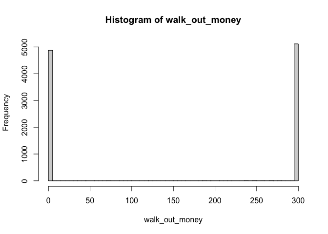<!-- -->

```r
# Estimated probability of walking out with extra cash
mean(walk_out_money > 200)
```

```
## [1] 0.5124
```

```r
# Estimated earnings
mean(walk_out_money - 200)
```

```
## [1] -46.2891
```

# Results

## How I used computer simulation to calculate the average earnings of a gambler that uses this strategy.

In the "budget" vector, the last element is the final budget. Since we started from $200, "The fianl budget - $200" is the earnings. I simulated this game for 10,000 times, and then calculated the average earnings. The simulation says the average loss is $45.111 when the gambler starts the game with $200 budget with a goal to finish when his budget hits $300 and maximum number of game 1,000, and the casino's $100 wager limitation.

In each simulation, overall, the earnings are increasing as we play more game. However, at some point, the earnings dropped significantly. You can see the trend of earnings depending on play numbers below.


```r
# Estimated earnings
mean(walk_out_money - 200)
```

```
## [1] -46.2891
```

```r
# Showing how the gambler's earnings(or losses) evolve over a series of plays. (The x-axis is the play number and the y-axis is earnings.)
earnings <- one_series(B = 200, W = 300, L =  1000, M = 100) - 200
plot(c(1:length(earnings)), earnings,type="l", xlab="play number", ylab="Earnings")
```

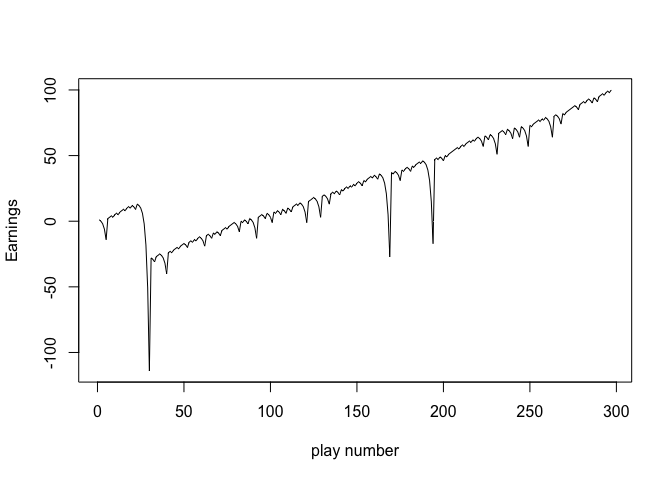<!-- -->

## How changing a parameter of the simulation does or does not have an impact on average earnings.

1) Changing budget (B)
This time, I will increase the budget(B) to $250. As you can see below, when the budget is $250, the average of loss is around $31. The amount of loss is decreased, compared to when the budget(B) was $200.

```r
# Simulation
walk_out_money <- rep(NA, 10000)
number_of_plays <- rep(NA, 10000)
for(j in seq_along(walk_out_money)){
  walk_out_money[j] <- one_series(B = 250, W = 300, L = 1000, M = 100) %>% get_last
  number_of_plays[j] <- length(one_series(B= 250, W = 300, L = 1000, M = 100))
}

# Walk out money distribution
hist(walk_out_money, breaks = 100)
```

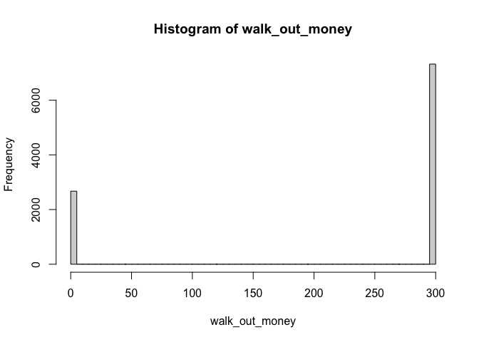<!-- -->

```r
# Estimated earnings
mean(walk_out_money - 250)
```

```
## [1] -30.2598
```
This time, I will increase the budget(B) to $280. As you can see below, when the budget is $280, the average of loss is around $14. The more budget we have, the less loss happens.

```r
# Simulation
walk_out_money <- rep(NA, 10000)
number_of_plays <- rep(NA, 10000)
for(j in seq_along(walk_out_money)){
  walk_out_money[j] <- one_series(B = 280, W = 300, L = 1000, M = 100) %>% get_last
  number_of_plays[j] <- length(one_series(B= 280, W = 300, L = 1000, M = 100))
}

# Walk out money distribution
hist(walk_out_money, breaks = 100)
```

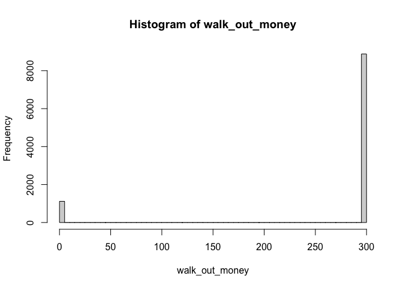<!-- -->

```r
# Estimated earnings
mean(walk_out_money - 280)
```

```
## [1] -13.5597
```
And then, I will decrease the budget(B) to $100. As you can see below, when the budget is 280, the average of loss is around $14. The more budget we have, the less loss happens.

```r
# Simulation
walk_out_money <- rep(NA, 10000)
number_of_plays <- rep(NA, 10000)
for(j in seq_along(walk_out_money)){
  walk_out_money[j] <- one_series(B = 100, W = 300, L = 1000, M = 100) %>% get_last
  number_of_plays[j] <- length(one_series(B= 100, W = 300, L = 1000, M = 100))
}

# Walk out money distribution
hist(walk_out_money, breaks = 100)
```

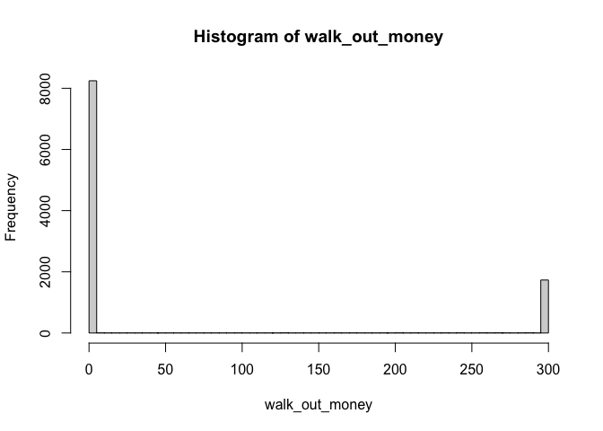<!-- -->

```r
# Estimated earnings
mean(walk_out_money - 100)
```

```
## [1] -47.5723
```

2) Changing the budget threshold for successfully stopping. (W)
Let's change the budget threshold (W) into 400. Even though I raised the budget threshold, the average of loss is increased to around $75.

```r
# Simulation
walk_out_money <- rep(NA, 10000)
number_of_plays <- rep(NA, 10000)
for(j in seq_along(walk_out_money)){
  walk_out_money[j] <- one_series(B = 200, W = 400, L = 1000, M = 100) %>% get_last
  number_of_plays[j] <- length(one_series(B= 200, W = 400, L = 1000, M = 100))
}

# Walk out money distribution
hist(walk_out_money, breaks = 100)
```

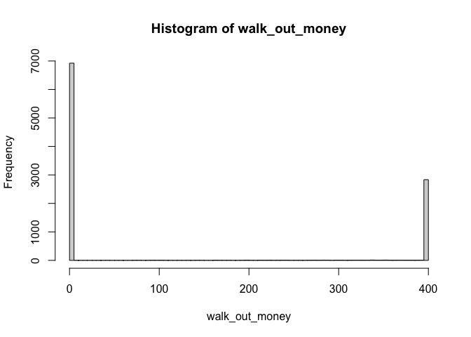<!-- -->

```r
# Estimated earnings
mean(walk_out_money - 200)
```

```
## [1] -79.8544
```

To understand the trend of budget threshold (W), I simulated the average of earnings when the budget threshold is 500. The average of loss is around $96. The more budget threshold you set, the more the average of loss happen.

```r
# Simulation
walk_out_money <- rep(NA, 10000)
number_of_plays <- rep(NA, 10000)
for(j in seq_along(walk_out_money)){
  walk_out_money[j] <- one_series(B = 200, W = 500, L = 1000, M = 100) %>% get_last
  number_of_plays[j] <- length(one_series(B= 200, W = 500, L = 1000, M = 100))
}

# Walk out money distribution
hist(walk_out_money, breaks = 100)
```

<!-- -->

```r
# Estimated earnings
mean(walk_out_money - 200)
```

```
## [1] -99.6725
```

3) Changing the maximum number of plays (L)
when the maximum number of plays is 10, the average of loss is around $1.8266, even though the estimated probability of walking out with extra cash is around 80%

```r
# Simulation
walk_out_money <- rep(NA, 10000)
number_of_plays <- rep(NA, 10000)
for(j in seq_along(walk_out_money)){
  walk_out_money[j] <- one_series(B = 200, W = 300, L = 10, M = 100) %>% get_last
  number_of_plays[j] <- length(one_series(B= 200, W = 300, L = 10, M = 100))
}

# Estimated probability of walking out with extra cash
mean(walk_out_money > 200)
```

```
## [1] 0.8051
```

```r
# Walk out money distribution
hist(walk_out_money, breaks = 100)
```

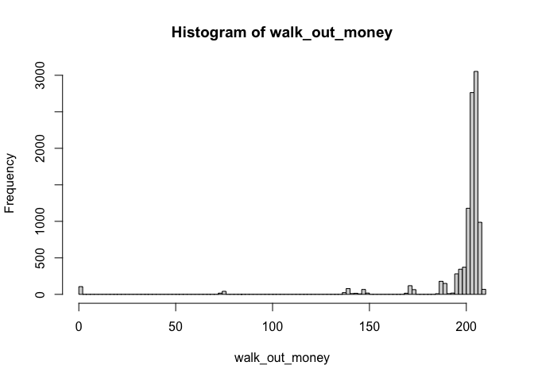<!-- -->

```r
# Estimated earnings
mean(walk_out_money - 200)
```

```
## [1] -1.6905
```
When the maximum of the plays is 5, the average of loss is around $0.55. 

```r
# Simulation
walk_out_money <- rep(NA, 10000)
number_of_plays <- rep(NA, 10000)
for(j in seq_along(walk_out_money)){
  walk_out_money[j] <- one_series(B = 200, W = 300, L = 5, M = 100) %>% get_last
  number_of_plays[j] <- length(one_series(B= 200, W = 300, L = 5, M = 100))
}

# Estimated probability of walking out with extra cash
mean(walk_out_money > 200)
```

```
## [1] 0.6904
```

```r
# Walk out money distribution
hist(walk_out_money, breaks = 100)
```

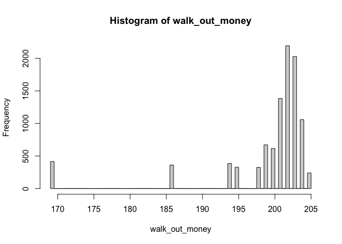<!-- -->

```r
# Estimated earnings
mean(walk_out_money - 200)
```

```
## [1] -0.5876
```
When the maximum of the plays is 100, the average of loss is around $20. However, still the estimated probability of walking out with extra cash is over 50%, which is around 68%.

```r
# Simulation
walk_out_money <- rep(NA, 10000)
number_of_plays <- rep(NA, 10000)
for(j in seq_along(walk_out_money)){
  walk_out_money[j] <- one_series(B = 200, W = 300, L = 100, M = 100) %>% get_last
  number_of_plays[j] <- length(one_series(B= 200, W = 300, L = 100, M = 100))
}

# Estimated probability of walking out with extra cash
mean(walk_out_money > 200)
```

```
## [1] 0.6897
```

```r
# Walk out money distribution
hist(walk_out_money, breaks = 100)
```

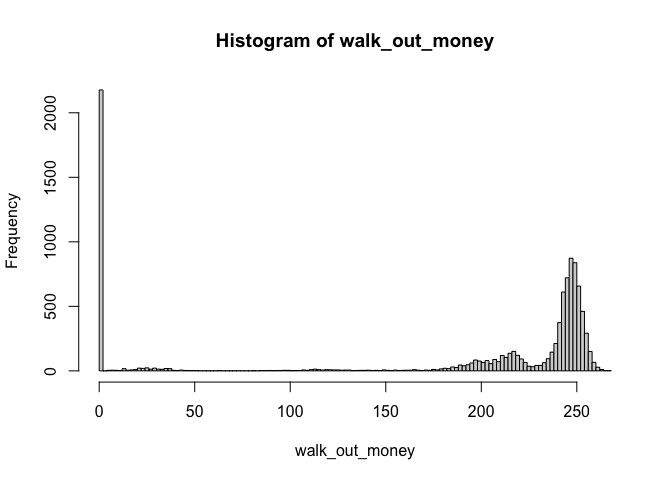<!-- -->

```r
# Estimated earnings
mean(walk_out_money - 200)
```

```
## [1] -20.7665
```
When the maximum of the plays is 500, the average of loss is around $41.9436. However, still the estimated probability of walking out with extra cash is over 50%, which is around 52%. 

```r
# Simulation
walk_out_money <- rep(NA, 10000)
number_of_plays <- rep(NA, 10000)
for(j in seq_along(walk_out_money)){
  walk_out_money[j] <- one_series(B = 200, W = 300, L = 500, M = 100) %>% get_last
  number_of_plays[j] <- length(one_series(B= 200, W = 300, L = 500, M = 100))
}

# Estimated probability of walking out with extra cash
mean(walk_out_money > 200)
```

```
## [1] 0.5112
```

```r
# Walk out money distribution
hist(walk_out_money, breaks = 100)
```

<!-- -->

```r
# Estimated earnings
mean(walk_out_money - 200)
```

```
## [1] -45.5874
```

4) changing the casino wager limit (M)

When the casino wager limit (M) is $50, the average of loss is $66.7265.

```r
# Simulation
walk_out_money <- rep(NA, 10000)
number_of_plays <- rep(NA, 10000)
for(j in seq_along(walk_out_money)){
  walk_out_money[j] <- one_series(B = 200, W = 300, L = 1000, M = 50) %>% get_last
  number_of_plays[j] <- length(one_series(B= 200, W = 300, L = 1000, M = 50))
}

# Walk out money distribution
hist(walk_out_money, breaks = 100)
```

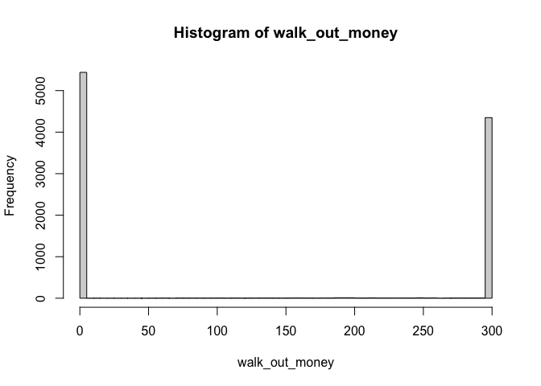<!-- -->

```r
# Estimated earnings
mean(walk_out_money - 200)
```

```
## [1] -65.5166
```
When the casino wager limit (M) is $200, the average of loss is $40.7768

```r
# Simulation
walk_out_money <- rep(NA, 10000)
number_of_plays <- rep(NA, 10000)
for(j in seq_along(walk_out_money)){
  walk_out_money[j] <- one_series(B = 200, W = 300, L = 1000, M = 200) %>% get_last
  number_of_plays[j] <- length(one_series(B= 200, W = 300, L = 1000, M = 200))
}

# Walk out money distribution
hist(walk_out_money, breaks = 100)
```

<!-- -->

```r
# Estimated earnings
mean(walk_out_money - 200)
```

```
## [1] -42.5629
```
When the casino limit wager is $300, the average loss is $40.8375.

```r
# Simulation
walk_out_money <- rep(NA, 10000)
number_of_plays <- rep(NA, 10000)
for(j in seq_along(walk_out_money)){
  walk_out_money[j] <- one_series(B = 200, W = 300, L = 1000, M = 300) %>% get_last
  number_of_plays[j] <- length(one_series(B= 200, W = 300, L = 1000, M = 300))
}

# Walk out money distribution
hist(walk_out_money, breaks = 100)
```

<!-- -->

```r
# Estimated earnings
mean(walk_out_money - 200)
```

```
## [1] -43.6803
```
When the casino wager limit is $500, the average of loss is $42.5545.

```r
# Simulation
walk_out_money <- rep(NA, 10000)
number_of_plays <- rep(NA, 10000)
for(j in seq_along(walk_out_money)){
  walk_out_money[j] <- one_series(B = 200, W = 300, L = 1000, M = 500) %>% get_last
  number_of_plays[j] <- length(one_series(B= 200, W = 300, L = 1000, M = 500))
}

# Walk out money distribution
hist(walk_out_money, breaks = 100)
```

<!-- -->

```r
# Estimated earnings
mean(walk_out_money - 200)
```

```
## [1] -43.6511
```
When the casino limit wager is $700, the average of loss is $40.9492. In consideration of the results so far, the casino limit waver (M) does not impact the average of earnings.

```r
# Simulation
walk_out_money <- rep(NA, 10000)
number_of_plays <- rep(NA, 10000)
for(j in seq_along(walk_out_money)){
  walk_out_money[j] <- one_series(B = 200, W = 300, L = 1000, M = 700) %>% get_last
  number_of_plays[j] <- length(one_series(B= 200, W = 300, L = 1000, M = 700))
}

# Walk out money distribution
hist(walk_out_money, breaks = 100)
```

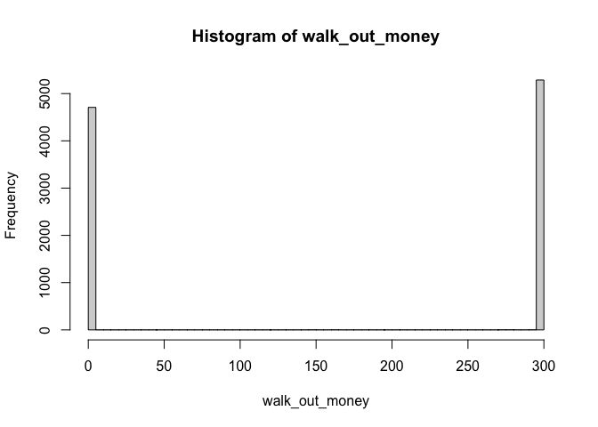<!-- -->

```r
# Estimated earnings
mean(walk_out_money - 200)
```

```
## [1] -41.274
```

## How I used computer simulation to estimate the average number of plays before stopping.

Since "One_series" function's outcome is the "budget" vector including each budget right after spinning the roulette. Therefore, the number of element in this vector is same with how many games the player palyed in one simulation. 

I made a new storing place to save each number of games in each simulation. I called the storing place "number_of_plays". With every number of plays in 10,000 simulation, I can calculate the average number of plays before stopping, which is around 201.


```r
# Simulation
walk_out_money <- rep(NA, 10000)
for(j in seq_along(walk_out_money)){
  walk_out_money[j] <- one_series(B = 200, W = 300, L = 1000, M = 100) %>% get_last
  number_of_plays[j] <- length(one_series(B= 200, W = 300, L = 1000, M = 100))
}

# Estimated the number of plays before stopping
mean(number_of_plays)
```

```
## [1] 201.2712
```

## The limitations of the simulation

In this simulation, when we see the histogram of parameters' with starting value (B = 200, W = 300, L = 1000, M = 100), the distribution is divided into two dramatically; either $0 or $300, which means the game will last until the gambler lose all his money or he earn the amount of money he planned before. The problem of this is the number of plays is too big. In reality, there is very small possibility that people play the game that much. If we decreased the number of how many game we play, you can see distributions between $0 to $300. Therefore, the simulation did not consider when game happened with realistic numbers.

# Conclusions

When we follow this Martingale strategy, the average of earnings is negative, which means we would lose money on average. In each game, earnings, overall, shows a tendency to increase, but it is decreases significantly from time to time. Among 4 variables, the casino wager limit does not give an impact on average earnings. On the other hand, the more you play games, the more loss you will make. Also, the more budget we have, the less loss we will have. Moreover, the more budget threshold for successfully stopping is, the more average of loss will happen. If we start the roulette game with $200 and the budget threshold is $300, the maximum number of plays is 1,000, and the casino wager limit is $100, the estimated  average number of plays before stopping is around 201. This strategy can be helpful only when we have unlimited budget and the number of game we can play.
