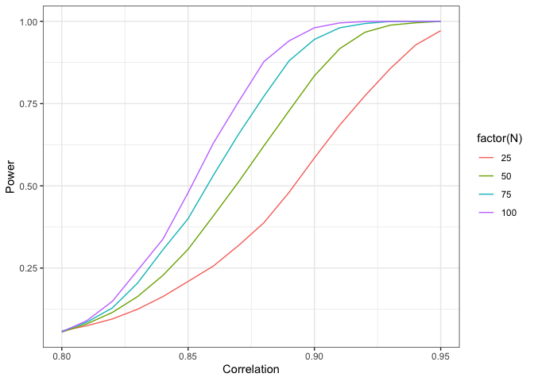

11-correlation-power
================
Soyeon Park
11/29/2020

# Simulation study: Power and sample size calculations correlational studies

In this blog post, I am going to perform a power and sample size
calculation for a collaborator who is submitting a grant application to
fund a study to show that two measurements are highly correlated.
Reviewers of the grant want to fund studies that have a high likelihood
of success, which in this setting is conclusively demonstrating that the
correlation between A and B is greater than 0.8.

The researcher will collect both measurements on N individuals. The
analysis will proceed by calculating a one-sided confidence interval. If
the confidence interval is completely within the range from 0.8 to 1,
then the researcher will consider the study to be a success: A
conclusive demonstration that the correlation between A and B is greater
than 0.8.

**Power** is the probability that the study will end in success when the
true underlying correlation is, in fact, greater than 0.8. (Note the
connection to Type II error (β): **power** = 1 - β.) Your collaborator
needs you to estimate power for different combinations of sample size
and the true population correlation. Let the sample size be 25, 50, 75,
and 100. Let the population correlation range from 0.8 to 0.95.

The code below provides the power calculation for a single combination
of N and population correlation.

``` r
set.seed(20394)
suppressPackageStartupMessages(require(mvtnorm))
library(ggplot2)
# Sample Size
N <- 50

# True population correlation
rho <- .8
null_correlation <- 0.8
R <- 5000

sigma <- array(c(1,rho,rho,1), c(2,2))
mu <- c(0,0)

detect <- rep(NA, R)
for(i in 1:R){
  data <- rmvnorm(N, mean = mu, sigma = sigma)
  # Measurement A is data[,1]
  # Measurement B is data[,2]
  # Option Alternative = "greater" is one-sided 95% CI
  results <- cor.test(x = data[,1], y = data[,2], alternative = "greater")
  
  # Test is lower bound is strictly greater than 0.8
  detect[i] <- results$conf.int[1] > null_correlation
}
power <- mean(detect)
```

I created the function called `power.corr`. This returns the probability
that the study will end in success when the true underlying correlation
is greater than 0.8. I chosed 4 sample sizes: 25, 50, 75, 100. And the
range of the true population correlation is from 0.8 to 0.95. I
simulated this experiment 5000 times. The plot below shows that
regardless of the sample size, the power is increasing as the
correlation is getting bigger. Moreover, when the correlation is same,
the bigger the sample size is, the higher the power probability is.

``` r
power.corr = function(N, rho){
  null_correlation <- 0.8
  R <- 5000
  power = NA
  for(j in 1:length(rho)) {
    sigma <- array(c(1,rho[j],rho[j],1), c(2,2))
    mu <- c(0,0)

    detect <- rep(NA, R)
    for(i in 1:R){
      data <- rmvnorm(N[j], mean = mu, sigma = sigma)
      # Measurement A is data[,1]
      # Measurement B is data[,2]
      # Option Alternative = "greater" is one-sided 95% CI
      results <- cor.test(x = data[,1], y = data[,2], alternative = "greater")
  
      # Test is lower bound is strictly greater than 0.8
      detect[i] <- results$conf.int[1] > null_correlation
    }
    power[j] <- mean(detect)
  }
  return(power)
}

# Sample Size
N <- c(25, 50, 75, 100)

# True population correlation
rho <- seq(0.8, 0.95, by = 0.01)

results1 <- expand.grid(N = N, rho = rho, power = NA)
 
for(i in 1:nrow(results1)) {
  results1[i,3] = power.corr(N = results1[i,1], rho = results1[i,2])
}

ggplot(mapping = aes(x = rho, y = power, col = factor(N)), data = results1) +
  geom_line() + 
  theme_bw() +
  labs(x = "Correlation", y = "Power")
```

<!-- -->
